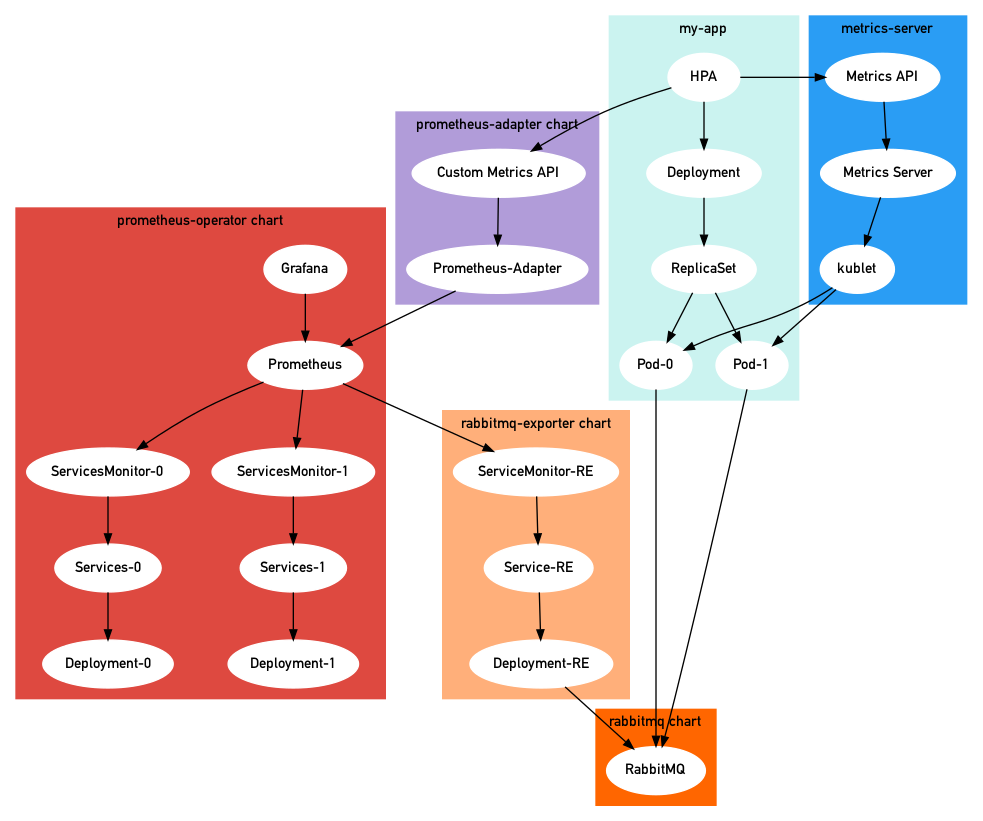
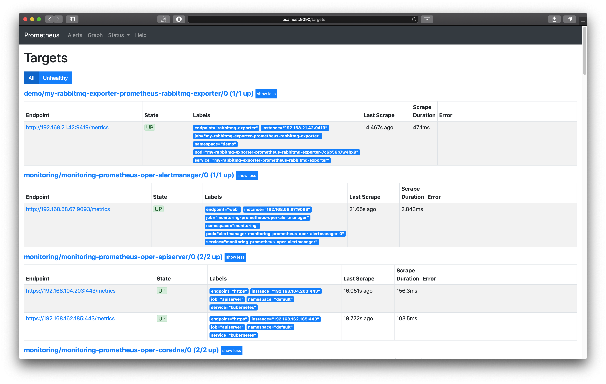

# k8s-hpa

Horizontal Pod Autoscaler (HPA) is a powerful and essential tool in the toolbox of Kubernetes (K8s), but configuring HPA is not straight-forward and easy due to fast iterating APIs and complicated components involved in.

I try to leverage the fascinating works of K8s communities with minimal customization to configure production-ready HPA. Hopefully this can be a starting point for anyone who is interested in this tooling.

In this repo, we will use RabbitMQ as custom metric inputs.

## <a name="toc"></a>Contents

- [Prerequisites](#prerequisites)
- [Overview](#overview)
- [Implementation](#implementation)
    - [Setting up the Metrics Server](#setting-up-the-metrics-server)
    - [Auto scaling based on CPU and memory usage](#auto-scaling-based-on-cpu-and-memory-usage)
    - [Setting up Prometheus](#setting-up-prometheus)
    - [Setting up RabbitMQ and Prometheus RabbitMQ Exporter](#setting-up-rabbitmq-and-prometheus-rabbitmq-exporter)
    - [Setting up Custom Metrics Server](#setting-up-custom-metrics-server)
    - [Auto scaling based on queue length](#auto-scaling-based-on-queue-length)
    - [Cleanup](#cleanup)
- [References](#references)

## Prerequisites

- [jq](https://stedolan.github.io/jq/) `1.6`
- [helm](https://helm.sh) `3.0.2`
- [kubectl](https://kubernetes.io/docs/tasks/tools/install-kubectl/) `1.18.2`
- Kubernetes `1.15.11`

## Overview



## Implementation

### Setting up the Metrics Server

The Kubernetes [Metrics Server](https://github.com/kubernetes-sigs/metrics-server) is an aggregator of resource usage data in the cluster, which is pre-installed in latest AKS and GKE but not for EKS.

```sh
kubectl apply -f https://github.com/kubernetes-sigs/metrics-server/releases/download/v0.3.6/components.yaml
```

Verifying the installation:

```sh
kubectl get apiservices v1beta1.metrics.k8s.io
```
```sh
NAME                     SERVICE                      AVAILABLE   AGE
v1beta1.metrics.k8s.io   kube-system/metrics-server   True        2d2h
```

View nodes metrics:

```sh
kubectl get --raw "/apis/metrics.k8s.io/v1beta1/nodes" | jq .
```

```json
{
  "kind": "NodeMetricsList",
  "apiVersion": "metrics.k8s.io/v1beta1",
  "metadata": {
    "selfLink": "/apis/metrics.k8s.io/v1beta1/nodes"
  },
  "items": [
    {
      "metadata": {
        "name": "ip-192-168-28-146.ec2.internal",
        "selfLink": "/apis/metrics.k8s.io/v1beta1/nodes/ip-192-168-28-146.ec2.internal",
        "creationTimestamp": "2020-05-14T18:53:23Z"
      },
      "timestamp": "2020-05-14T18:52:45Z",
      "window": "30s",
      "usage": {
        "cpu": "1257860336n",
        "memory": "1659908Ki"
      }
    },
  ]
}
```

### Auto scaling based on CPU and memory usage

```yaml
# hpa-v1.yml
---
apiVersion: autoscaling/v2beta2
kind: HorizontalPodAutoscaler
metadata:
  name: demo-service
  namespace: demo
spec:
  scaleTargetRef:
    apiVersion: apps/v1
    kind: Deployment
    name: demo-service
  minReplicas: 1
  maxReplicas: 4
  metrics:
    - type: Resource
      resource:
        name: cpu
        target:
          type: Utilization
          averageUtilization: 50
```

### Setting up Prometheus

Create `monitoring` namespace:

```sh
kubectl create namespace monitoring
```

Installing prometheus-operator:

```sh
helm install monitoring stable/prometheus-operator --set prometheus.prometheusSpec.serviceMonitorSelectorNilUsesHelmValues=false --namespace monitoring
```

In order to discover ServiceMonitors outside monitoring namespace, we need to set `prometheus.prometheusSpec.serviceMonitorSelectorNilUsesHelmValues` to `false` based on this [doc](https://github.com/helm/charts/tree/master/stable/prometheus-operator#prometheusioscrape).

We can go to Prometheus by visiting `localhost:9090` after port-forwarding the service to our localhost:

```sh
kubectl -n monitoring port-forward svc/monitoring-prometheus-oper-prometheus 9090
```

We can check Grafana dashboard on `localhost:8080` by port-forwarding as well.

```sh
kubectl -n monitoring port-forward svc/monitoring-grafana 8080:80
```

the default credentials for Grafana:
```
username: admin
password: prom-operator
```

### Setting up RabbitMQ and Prometheus RabbitMQ Exporter

We will install rabbitmq related stuff under `demo` namespace

```sh
kubectl create namespace demo
```

```sh
helm install my-rabbitmq stable/rabbitmq --set rabbitmq.username=admin,rabbitmq.password=secretpassword,rabbitmq.erlangCookie=secretcookie -n demo
```

the credentials we created:

```sh
Username: admin
Password: secretpassword
```

We use this credentials in the prometheus-rabbitmq-exporter/values.yaml.

Install prometheus-rabbitmq-exporter

```sh
helm install my-rabbitmq-exporter stable/prometheus-rabbitmq-exporter -n demo -f prometheus-rabbitmq-exporter/values.yaml
```

After deploying done, we should be able to see the targets in the Prometheus on `localhost:9090/targets`



### Setting up Custom Metrics Server

Installing prometheus-adapter:

```sh
helm install custom-metrics-api -n monitoring stable/prometheus-adapter -f prometheus-adapter/values.yaml
```

We need to specify the prometheus url based on our above chart installation and setting up the custom rules. You can find the details in the `prometheus-adapter/values.yaml`.

The yalm file was built upon [configuration example](https://github.com/DirectXMan12/k8s-prometheus-adapter/blob/master/docs/config-walkthrough.md). And I highly recommend going through it to have a better understanding of the configuration.

Verifying the installation:

```sh
kubectl get apiservices v1beta1.custom.metrics.k8s.io
```
```sh
NAME                            SERVICE                                            AVAILABLE
v1beta1.custom.metrics.k8s.io   monitoring/custom-metrics-api-prometheus-adapter   True     
```

Now we can use the custom metrics API to get the information of the my-rabbitmq instance

```sh
kubectl get --raw /apis/custom.metrics.k8s.io/v1beta1 | jq .
```

```json
{
  "kind": "APIResourceList",
  "apiVersion": "v1",
  "groupVersion": "custom.metrics.k8s.io/v1beta1",
  "resources": [
    {
      "name": "namespaces/rabbitmq_queue_messages_ready",
      "singularName": "",
      "namespaced": false,
      "kind": "MetricValueList",
      "verbs": [
        "get"
      ]
    },
    {
      "name": "services/rabbitmq_queue_messages_ready",
      "singularName": "",
      "namespaced": true,
      "kind": "MetricValueList",
      "verbs": [
        "get"
      ]
    }
  ]
}
```

And we can get the `rabbitmq_queue_messages_ready` metric for a specific queue by using metricLabelSelector query in the api. (You need to make sure `test` queue exists in the RabbitMQ before running below command)

```sh
kubectl get --raw "/apis/custom.metrics.k8s.io/v1beta1/namespaces/demo/services/my-rabbitmq-exporter-prometheus-rabbitmq-exporter/rabbitmq_queue_messages_ready?metricLabelSelector=queue%3Dtest" | jq .
```

```json
{
  "kind": "MetricValueList",
  "apiVersion": "custom.metrics.k8s.io/v1beta1",
  "metadata": {
    "selfLink": "/apis/custom.metrics.k8s.io/v1beta1/namespaces/demo/services/my-rabbitmq-exporter-prometheus-rabbitmq-exporter/rabbitmq_queue_messages_ready"
  },
  "items": [
    {
      "describedObject": {
        "kind": "Service",
        "namespace": "demo",
        "name": "my-rabbitmq-exporter-prometheus-rabbitmq-exporter",
        "apiVersion": "/v1"
      },
      "metricName": "rabbitmq_queue_messages_ready",
      "timestamp": "2020-05-15T15:19:57Z",
      "value": "3",
      "selector": null
    }
  ]
}
```

### Auto scaling based on queue length

```yaml
# hpa-v2.yml
---
apiVersion: autoscaling/v2beta2
kind: HorizontalPodAutoscaler
metadata:
  name: demo-service
  namespace: demo
spec:
  scaleTargetRef:
    apiVersion: apps/v1
    kind: Deployment
    name: demo-service
  minReplicas: 1
  maxReplicas: 4
  metrics:
    - type: Object
      object:
        metric:
          name: rabbitmq_queue_messages_ready
          selector:
            matchLabels:
              queue: test
        describedObject:
          apiVersion: v1
          kind: Service
          name: my-rabbitmq-exporter-prometheus-rabbitmq-exporter
        target:
          type: Value
          value: "1"
```

### Cleanup

Uninstall charts and delete namespaces

```sh
helm delete -n demo my-rabbitmq-exporter
helm delete -n demo my-rabbitmq
helm delete -n monitoring monitoring
kubectl delete namespace demo
kubectl delete namespace monitoring
```

## References

- [Scaling Pods based on RabbitMQ Queue Depth](https://ryanbaker.io/2019-10-07-scaling-rabbitmq-on-k8s/)
- [Kubernetes基于RabbitMQ队列长度指标进行HPA](https://juejin.im/post/5e5f07fef265da57127e4f6b)
- [k8s-prom-hpa](https://github.com/stefanprodan/k8s-prom-hpa)
- [Kubernetes HPA Autoscaling with Custom Metrics](https://icicimov.github.io/blog/kubernetes/Kubernetes_HPA_Autoscaling_with_Custom_Metrics/)